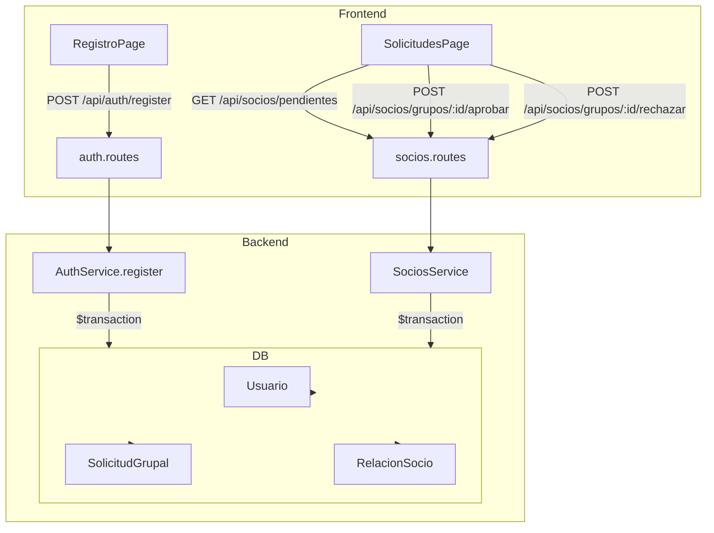
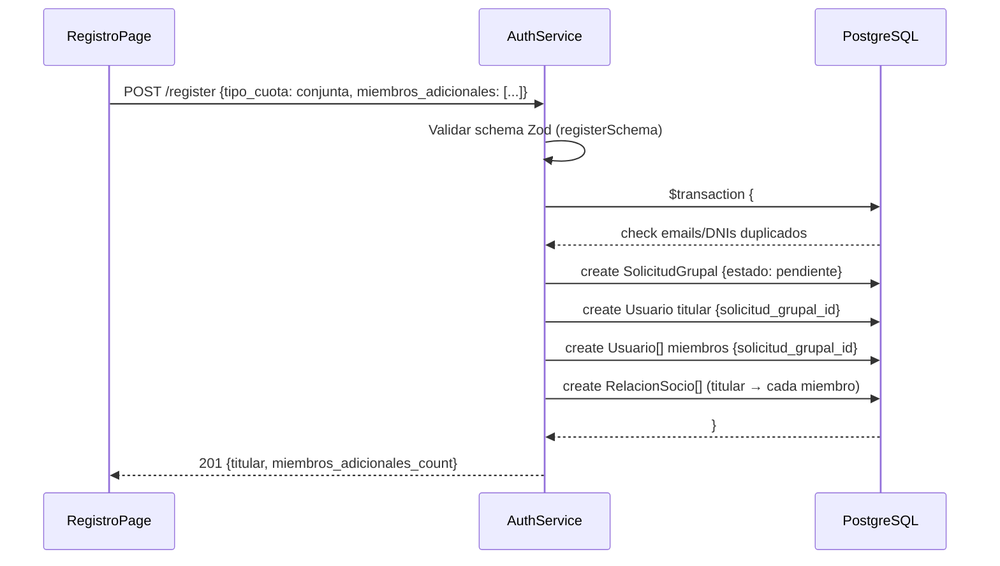
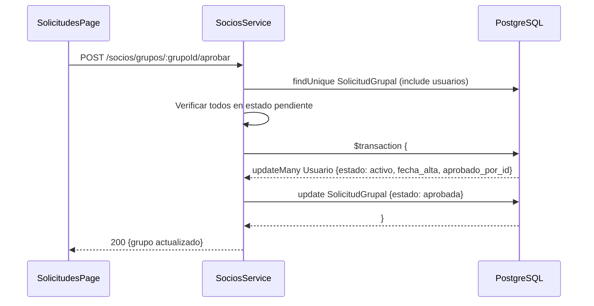
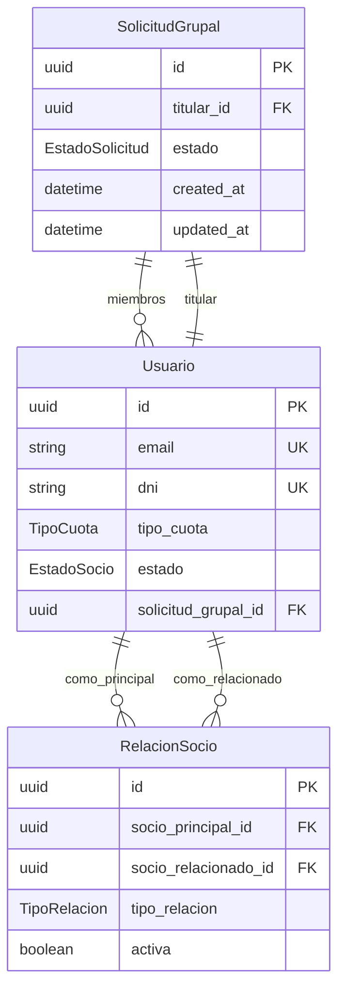

# Design Document — Cuota Conjunta

## Overview

Esta feature reemplaza el sistema de tres tipos de cuota (individual, pareja, familiar) por dos (individual, conjunta). La cuota conjunta permite que un Titular registre a su pareja o familiares directos en una única solicitud. El backend crea todos los usuarios y una entidad `SolicitudGrupal` en una transacción atómica. La directiva aprueba o rechaza el grupo completo de una sola acción.

### Decisiones de diseño clave

- **Migración no destructiva**: los valores `pareja` y `familiar` se migran a `conjunta` en una migration SQL explícita, sin pérdida de datos.
- **SolicitudGrupal como entidad de coordinación**: en lugar de inferir el grupo desde `RelacionSocio`, se introduce un modelo dedicado con estado propio. Esto simplifica las queries del panel de directiva y hace explícito el ciclo de vida de la solicitud.
- **Transacción única en registro**: toda la creación de usuarios, SolicitudGrupal y RelacionSocio ocurre en `prisma.$transaction`, garantizando atomicidad.
- **Precio calculado en frontend**: la fórmula `15 + 5 × N` es pura y se calcula en el cliente. No se persiste en BD porque es derivable del número de miembros.
- **Endpoint de pendientes diferenciado**: `GET /api/socios/pendientes` devuelve un objeto con dos arrays (`individuales` y `grupos`) en lugar de una lista plana, para que el frontend pueda renderizar cada tipo con su componente correspondiente.

---

## Architecture



### Flujo de registro conjunto



### Flujo de aprobación grupal



---

## Components and Interfaces

### Backend

#### `schema.prisma` — cambios

```prisma
enum TipoCuota {
  individual
  conjunta
}

enum TipoRelacion {
  pareja
  familiar_directo   // renombrado de 'hijo'/'padre' → valor semántico correcto
}

model SolicitudGrupal {
  id         String            @id @default(uuid())
  titular_id String
  estado     EstadoSolicitud   @default(pendiente)
  created_at DateTime          @default(now())
  updated_at DateTime          @updatedAt

  titular  Usuario   @relation("TitularGrupo", fields: [titular_id], references: [id])
  miembros Usuario[] @relation("MiembrosGrupo")
}

enum EstadoSolicitud {
  pendiente
  aprobada
  rechazada
}

// En modelo Usuario — campo añadido:
model Usuario {
  // ...campos existentes...
  solicitud_grupal_id String?
  solicitud_grupal    SolicitudGrupal? @relation("MiembrosGrupo", fields: [solicitud_grupal_id], references: [id])
  grupo_como_titular  SolicitudGrupal? @relation("TitularGrupo")
}
```

#### `auth.schema.ts` — nuevo registerSchema

```typescript
const miembroAdicionalSchema = z.object({
  nombre: z.string().min(1),
  apellidos: z.string().min(1),
  dni: z.string().regex(/^[0-9]{8}[A-Za-z]$/),
  email: z.string().email(),
  password: z.string().min(8).regex(/[A-Z]/).regex(/[0-9]/),
  confirmPassword: z.string(),
  tipo_relacion: z.enum(['pareja', 'familiar_directo']),
}).refine(d => d.password === d.confirmPassword, {
  message: 'Las contraseñas no coinciden',
  path: ['confirmPassword'],
})

export const registerSchema = z.discriminatedUnion('tipo_cuota', [
  // Rama individual — sin miembros adicionales
  z.object({ tipo_cuota: z.literal('individual'), /* ...campos titular... */ }),
  // Rama conjunta — con miembros adicionales obligatorios
  z.object({
    tipo_cuota: z.literal('conjunta'),
    /* ...campos titular... */
    miembros_adicionales: z.array(miembroAdicionalSchema).min(1).max(5),
  }),
])
```

> Nota: se usa `z.discriminatedUnion` para que Zod aplique la validación correcta según `tipo_cuota` sin necesidad de `.superRefine`.

#### `auth.service.ts` — método `register` actualizado

```typescript
async register(data: RegisterInput): Promise<RegisterResult> {
  // 1. Validar unicidad de todos los emails y DNIs del grupo
  // 2. Si individual → flujo actual
  // 3. Si conjunta → prisma.$transaction(async (tx) => {
  //      const grupo = await tx.solicitudGrupal.create(...)
  //      const titular = await tx.usuario.create({ solicitud_grupal_id: grupo.id, ... })
  //      for (const m of data.miembros_adicionales) {
  //        const miembro = await tx.usuario.create({ solicitud_grupal_id: grupo.id, ... })
  //        await tx.relacionSocio.create({ socio_principal_id: titular.id, socio_relacionado_id: miembro.id, tipo_relacion: m.tipo_relacion })
  //      }
  //    })
}
```

#### `socios.service.ts` — métodos nuevos/modificados

| Método | Descripción |
|---|---|
| `getPendientes()` | Devuelve `{ individuales: Usuario[], grupos: SolicitudGrupalConMiembros[] }` |
| `aprobarGrupo(grupoId, aprobadoPorId)` | Transacción: actualiza todos los usuarios + SolicitudGrupal |
| `rechazarGrupo(grupoId, bajaPorId)` | Transacción: actualiza todos los usuarios + SolicitudGrupal |

#### `socios.routes.ts` — rutas nuevas

```
POST /api/socios/grupos/:grupoId/aprobar   → requireRoles(DIRECTIVA)
POST /api/socios/grupos/:grupoId/rechazar  → requireRoles(DIRECTIVA)
```

### Frontend

#### `frontend/src/types/api.ts` — tipos nuevos/modificados

```typescript
export type TipoCuota = 'individual' | 'conjunta'
export type TipoRelacion = 'pareja' | 'familiar_directo'
export type EstadoSolicitud = 'pendiente' | 'aprobada' | 'rechazada'

export interface MiembroAdicionalPayload {
  nombre: string
  apellidos: string
  dni: string
  email: string
  password: string
  confirmPassword: string
  tipo_relacion: TipoRelacion
}

export interface SolicitudGrupal {
  id: string
  estado: EstadoSolicitud
  titular: Pick<Usuario, 'id' | 'nombre' | 'apellidos' | 'dni' | 'email'>
  miembros: Array<Pick<Usuario, 'id' | 'nombre' | 'apellidos' | 'dni' | 'email'> & { tipo_relacion: TipoRelacion }>
  created_at: string
}

// RegisterPayload actualizado
export type RegisterPayload =
  | { tipo_cuota: 'individual'; /* ...campos titular... */ }
  | { tipo_cuota: 'conjunta'; /* ...campos titular... */; miembros_adicionales: MiembroAdicionalPayload[] }
```

#### `RegistroPage.tsx` — sección de miembros adicionales

- Cuando `tipo_cuota === 'conjunta'`, se renderiza una sección con `useFieldArray` de react-hook-form.
- Cada miembro tiene sus propios campos (nombre, apellidos, DNI, email, password, confirmPassword, tipo_relacion).
- Un botón "Añadir miembro" (deshabilitado si ya hay 5) y un botón "Eliminar" por miembro.
- El precio total se calcula con `calcularPrecio(miembros.length)` y se muestra en tiempo real.
- La validación cross-field (unicidad de emails/DNIs entre miembros) se implementa con `.superRefine` en el schema Zod del formulario.

```typescript
// Función pura de cálculo de precio
export function calcularPrecio(numMiembrosAdicionales: number): number {
  return 15 + 5 * numMiembrosAdicionales
}
```

#### `SolicitudesPage.tsx` — tarjetas grupales

- El hook `useQuery` llama a `sociosApi.getPendientes()` que ahora devuelve `{ individuales, grupos }`.
- Se renderiza `<AltaSolicitudCard>` para individuales (sin cambios).
- Se renderiza `<GrupoSolicitudCard>` para cada `SolicitudGrupal`, mostrando titular + miembros + precio total + botones Aprobar/Rechazar que llaman a los nuevos endpoints.

#### `frontend/src/services/api/socios.ts` — métodos nuevos

```typescript
getPendientes: () => api.get<{ data: { individuales: SocioAdmin[]; grupos: SolicitudGrupal[] } }>('/socios/pendientes'),
aprobarGrupo: (grupoId: string) => api.post(`/socios/grupos/${grupoId}/aprobar`, {}),
rechazarGrupo: (grupoId: string) => api.post(`/socios/grupos/${grupoId}/rechazar`, {}),
```

---

## Data Models

### Migración SQL

```sql
-- 1. Añadir nuevo valor al enum
ALTER TYPE "TipoCuota" ADD VALUE 'conjunta';

-- 2. Migrar datos existentes
UPDATE "Usuario" SET "tipo_cuota" = 'conjunta'
WHERE "tipo_cuota" IN ('pareja', 'familiar');

-- 3. Eliminar valores obsoletos (requiere recrear el enum en PostgreSQL)
-- Se hace en una migration separada tras confirmar que no quedan registros con esos valores.

-- 4. Crear enum EstadoSolicitud
CREATE TYPE "EstadoSolicitud" AS ENUM ('pendiente', 'aprobada', 'rechazada');

-- 5. Crear tabla SolicitudGrupal
CREATE TABLE "SolicitudGrupal" (
  "id"         UUID PRIMARY KEY DEFAULT gen_random_uuid(),
  "titular_id" UUID NOT NULL REFERENCES "Usuario"("id"),
  "estado"     "EstadoSolicitud" NOT NULL DEFAULT 'pendiente',
  "created_at" TIMESTAMP NOT NULL DEFAULT NOW(),
  "updated_at" TIMESTAMP NOT NULL DEFAULT NOW()
);

-- 6. Añadir FK en Usuario
ALTER TABLE "Usuario" ADD COLUMN "solicitud_grupal_id" UUID REFERENCES "SolicitudGrupal"("id");

-- 7. Actualizar enum TipoRelacion (añadir familiar_directo, mantener pareja)
ALTER TYPE "TipoRelacion" ADD VALUE 'familiar_directo';
```

### Diagrama ER (cambios)



### Respuesta de `GET /api/socios/pendientes`

```typescript
{
  data: {
    individuales: SocioAdmin[],
    grupos: Array<{
      id: string
      estado: 'pendiente'
      created_at: string
      titular: { id, nombre, apellidos, dni, email, apodo?, alias_telegram? }
      miembros: Array<{ id, nombre, apellidos, dni, email, tipo_relacion }>
    }>
  }
}
```

---

## Correctness Properties

*A property is a characteristic or behavior that should hold true across all valid executions of a system — essentially, a formal statement about what the system should do. Properties serve as the bridge between human-readable specifications and machine-verifiable correctness guarantees.*

### Property 1: Migración de datos preserva semántica

*For any* registro en la base de datos con `tipo_cuota` igual a `'pareja'` o `'familiar'` antes de la migración, después de ejecutar la migración ese registro SHALL tener `tipo_cuota = 'conjunta'` y ningún registro SHALL tener `tipo_cuota` con valor `'pareja'` o `'familiar'`.

**Validates: Requirements 1.3**

---

### Property 2: Invariante de asociación grupal

*For any* usuario con `tipo_cuota = 'conjunta'` en la base de datos, ese usuario SHALL tener exactamente un `solicitud_grupal_id` no nulo que referencia una `SolicitudGrupal` existente.

**Validates: Requirements 2.2**

---

### Property 3: Invariante de no-asociación individual

*For any* usuario con `tipo_cuota = 'individual'` creado mediante el endpoint de registro, ese usuario SHALL tener `solicitud_grupal_id = null`.

**Validates: Requirements 2.3, 5.2**

---

### Property 4: Atomicidad del registro conjunto

*For any* payload de registro conjunto con N miembros adicionales (1 ≤ N ≤ 5), si el registro tiene éxito entonces SHALL existir exactamente 1 `SolicitudGrupal`, N+1 `Usuario` con `solicitud_grupal_id` apuntando a esa solicitud, y N entradas en `RelacionSocio`. Si cualquier parte falla (email/DNI duplicado en cualquier miembro), entonces SHALL existir 0 `SolicitudGrupal` nuevas y 0 `Usuario` nuevos del grupo.

**Validates: Requirements 2.4, 5.3, 5.4, 5.5, 5.6**

---

### Property 5: Fórmula de precio

*For any* número N de miembros adicionales donde 0 ≤ N ≤ 5, la función `calcularPrecio(N)` SHALL devolver exactamente `15 + 5 * N`.

**Validates: Requirements 3.2, 3.3, 3.4, 3.5**

---

### Property 6: Validación de tamaño del grupo

*For any* payload de registro con `tipo_cuota = 'conjunta'`, el schema Zod SHALL rechazar el payload si `miembros_adicionales` tiene 0 elementos o más de 5 elementos, y SHALL aceptarlo si tiene entre 1 y 5 elementos (asumiendo que los demás campos son válidos).

**Validates: Requirements 4.3, 4.11, 8.3**

---

### Property 7: Validación de unicidad intra-grupo

*For any* payload de registro conjunto donde dos o más miembros (incluyendo el titular) comparten el mismo email o el mismo DNI, el schema de validación o el servicio SHALL rechazar el payload con un error que identifica el campo duplicado.

**Validates: Requirements 4.6, 4.7, 5.4**

---

### Property 8: Respuesta de pendientes diferenciada

*For any* estado de la base de datos con M solicitudes individuales pendientes y N grupos conjuntos pendientes, `GET /api/socios/pendientes` SHALL devolver exactamente M entradas en `individuales` y N entradas en `grupos`.

**Validates: Requirements 6.1, 6.5, 6.6**

---

### Property 9: Acción grupal atómica — aprobación

*For any* `SolicitudGrupal` en estado `pendiente` con K miembros (titular + adicionales), al ejecutar `aprobarGrupo` SHALL actualizarse el estado de los K usuarios a `activo` con `fecha_alta` y `aprobado_por_id` registrados, y el estado de la `SolicitudGrupal` a `aprobada`, todo en una única transacción.

**Validates: Requirements 7.3, 7.4, 7.5**

---

### Property 10: Acción grupal atómica — rechazo

*For any* `SolicitudGrupal` en estado `pendiente` con K miembros, al ejecutar `rechazarGrupo` SHALL actualizarse el estado de los K usuarios a `baja` con `fecha_baja` y `baja_por_id` registrados, y el estado de la `SolicitudGrupal` a `rechazada`, todo en una única transacción.

**Validates: Requirements 7.6, 7.7, 7.8**

---

### Property 11: Guard de estado en acción grupal

*For any* `SolicitudGrupal` donde al menos un miembro no está en estado `pendiente`, intentar aprobar o rechazar el grupo SHALL devolver un error 400 sin modificar ningún registro.

**Validates: Requirements 7.10**

---

## Error Handling

| Escenario | Código HTTP | Mensaje |
|---|---|---|
| Email duplicado (titular o miembro) | 409 | `"Ya existe una cuenta con ese email: {email}"` |
| DNI duplicado (titular o miembro) | 409 | `"Ya existe una cuenta con ese DNI: {dni}"` |
| Payload inválido (Zod) | 400 | `{ error: "Datos inválidos", details: {...} }` |
| Grupo no encontrado | 404 | `"Solicitud grupal no encontrada"` |
| Grupo no en estado pendiente | 400 | `"La solicitud grupal no está en estado pendiente"` |
| Miembro del grupo no en pendiente | 400 | `"El usuario {nombre} no está en estado pendiente"` |
| Más de 5 miembros adicionales | 400 | Rechazado por Zod antes de llegar al servicio |

### Estrategia de validación en capas

1. **Zod (schema)**: valida estructura, tipos, formato DNI, longitud de arrays, reglas de password.
2. **Servicio (pre-transacción)**: verifica unicidad de emails y DNIs consultando la BD antes de abrir la transacción.
3. **Transacción Prisma**: garantiza atomicidad; si falla cualquier operación, se hace rollback completo.

---

## Testing Strategy

### Enfoque dual

Se usan dos tipos de tests complementarios:

- **Unit tests**: verifican ejemplos concretos, casos límite y condiciones de error.
- **Property-based tests**: verifican propiedades universales sobre rangos de inputs generados aleatoriamente.

### Librería de property-based testing

- **Backend (TypeScript)**: [`fast-check`](https://github.com/dubzzz/fast-check) — mínimo 100 iteraciones por propiedad.
- **Frontend (TypeScript/React)**: `fast-check` también, para funciones puras como `calcularPrecio`.

### Tests unitarios (ejemplos y edge cases)

**Backend:**
- Registro individual exitoso → usuario creado sin `solicitud_grupal_id`
- Registro conjunto con 1 miembro → SolicitudGrupal + 2 usuarios + 1 RelacionSocio
- Registro conjunto con email duplicado en miembro → rollback completo, 0 usuarios creados
- Aprobación de grupo → todos los miembros activos
- Rechazo de grupo → todos los miembros en baja
- Intento de aprobar grupo ya aprobado → error 400
- `GET /socios/pendientes` con mezcla de individuales y grupos → respuesta diferenciada

**Frontend:**
- `calcularPrecio(0)` → 15
- `calcularPrecio(5)` → 40
- Formulario con `tipo_cuota=individual` → sección miembros oculta
- Formulario con `tipo_cuota=conjunta` → sección miembros visible
- Envío con 0 miembros adicionales en conjunta → error de validación

### Tests de propiedades (property-based)

Cada test referencia la propiedad del documento de diseño con el tag:
`// Feature: cuota-conjunta, Property N: <texto>`

**Property 4 — Atomicidad del registro conjunto:**
```typescript
// Feature: cuota-conjunta, Property 4: Atomicidad del registro conjunto
fc.assert(fc.asyncProperty(
  fc.integer({ min: 1, max: 5 }),
  async (numMiembros) => {
    const payload = generarPayloadConjunto(numMiembros)
    await authService.register(payload)
    const grupo = await prisma.solicitudGrupal.findFirst({ include: { miembros: true } })
    expect(grupo).not.toBeNull()
    expect(grupo!.miembros).toHaveLength(numMiembros + 1)
    const relaciones = await prisma.relacionSocio.count({ where: { socio_principal_id: grupo!.titular_id } })
    expect(relaciones).toBe(numMiembros)
  }
), { numRuns: 100 })
```

**Property 5 — Fórmula de precio:**
```typescript
// Feature: cuota-conjunta, Property 5: Fórmula de precio
fc.assert(fc.property(
  fc.integer({ min: 0, max: 5 }),
  (n) => calcularPrecio(n) === 15 + 5 * n
), { numRuns: 100 })
```

**Property 6 — Validación de tamaño del grupo:**
```typescript
// Feature: cuota-conjunta, Property 6: Validación de tamaño del grupo
fc.assert(fc.property(
  fc.oneof(fc.constant(0), fc.integer({ min: 6, max: 20 })),
  (n) => {
    const payload = generarPayloadConjunto(n)
    const result = registerSchema.safeParse(payload)
    return result.success === false
  }
), { numRuns: 100 })
```

**Property 9 — Aprobación grupal atómica:**
```typescript
// Feature: cuota-conjunta, Property 9: Acción grupal atómica — aprobación
fc.assert(fc.asyncProperty(
  fc.integer({ min: 1, max: 5 }),
  async (numMiembros) => {
    const grupo = await crearGrupoPendiente(numMiembros)
    await sociosService.aprobarGrupo(grupo.id, directivaId)
    const usuarios = await prisma.usuario.findMany({ where: { solicitud_grupal_id: grupo.id } })
    return usuarios.every(u => u.estado === 'activo' && u.fecha_alta !== null && u.aprobado_por_id !== null)
  }
), { numRuns: 100 })
```

**Property 11 — Guard de estado:**
```typescript
// Feature: cuota-conjunta, Property 11: Guard de estado en acción grupal
fc.assert(fc.asyncProperty(
  fc.integer({ min: 1, max: 5 }),
  async (numMiembros) => {
    const grupo = await crearGrupoPendiente(numMiembros)
    // Activar manualmente un miembro para romper el invariante
    await prisma.usuario.update({ where: { id: grupo.miembros[0].id }, data: { estado: 'activo' } })
    await expect(sociosService.aprobarGrupo(grupo.id, directivaId)).rejects.toThrow()
    // Verificar que no se modificó ningún otro miembro
    const restantes = await prisma.usuario.findMany({ where: { solicitud_grupal_id: grupo.id, id: { not: grupo.miembros[0].id } } })
    return restantes.every(u => u.estado === 'pendiente')
  }
), { numRuns: 100 })
```
