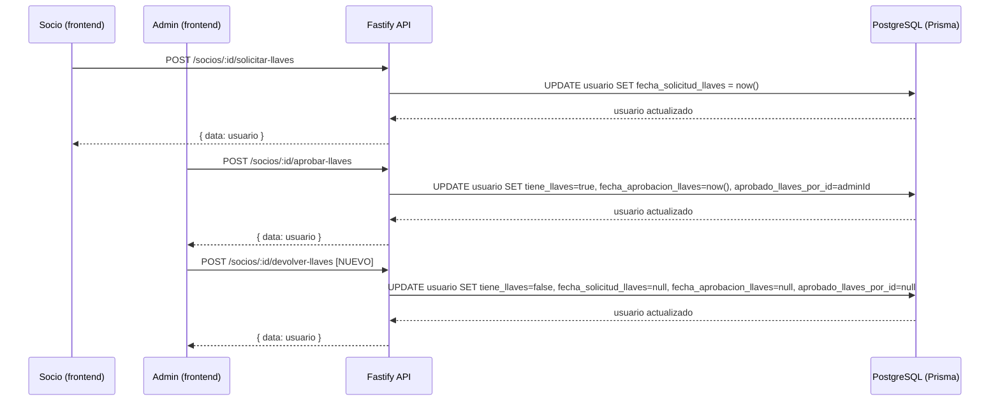

# Diseño Técnico — Gestión de Llaves

## Overview

La feature de gestión de llaves permite controlar qué socios tienen una llave física del local del Club Dragón de Madera. El flujo completo es: solicitud por el socio → revisión y aprobación por un admin → entrega física fuera del sistema → devolución registrada por un admin.

El backend ya tiene implementados `solicitarLlaves` y `aprobarLlaves` en `socios.service.ts`, y las rutas correspondientes en `socios.routes.ts`. El schema de Prisma ya contiene todos los campos necesarios (`tiene_llaves`, `fecha_solicitud_llaves`, `fecha_aprobacion_llaves`, `aprobado_llaves_por_id`). **No se requiere migración de base de datos.**

Lo que falta implementar:
- Backend: método `devolverLlaves` + ruta `POST /api/socios/:id/devolver-llaves`
- Frontend: botón de solicitud en el área del socio (`SocioPage`)
- Frontend: acción de devolución en el detalle del socio (`GestionSociosPage`)
- Frontend: sección de estado de llaves en el perfil del socio (vista admin y vista propia)
- Frontend: listado de titulares de llaves en el panel de directiva


## Architecture

El sistema sigue la arquitectura existente del proyecto: Fastify + Prisma en el backend, React + TanStack Query en el frontend. No se introduce ninguna capa nueva.




## Components and Interfaces

### Backend

#### `SociosService.devolverLlaves(socioId, adminId)` — NUEVO

```typescript
async devolverLlaves(socioId: string, adminId: string): Promise<Usuario>
```

- Verifica que el socio existe
- Verifica que `tiene_llaves === true`; si no, lanza `'El socio no tiene ninguna llave asignada'`
- Actualiza: `tiene_llaves = false`, `fecha_solicitud_llaves = null`, `fecha_aprobacion_llaves = null`, `aprobado_llaves_por_id = null`
- Devuelve el usuario actualizado con `SOCIO_PUBLIC_SELECT`

#### Ruta `POST /api/socios/:id/devolver-llaves` — NUEVA

- `preHandler: requireRoles(...ROLES.DIRECTIVA)`
- Llama a `sociosService.devolverLlaves(id, request.user.id)`
- Responde `{ message: 'Llave devuelta correctamente', data: socio }`

#### `sociosApi.devolverLlaves(id)` — NUEVO (frontend)

```typescript
devolverLlaves: (id: string) =>
  api.action<{ data: SocioAdmin }>(`/socios/${id}/devolver-llaves`)
```

### Frontend — Componentes afectados

| Componente | Cambio |
|---|---|
| `SocioPage` (área del socio) | Añadir sección "Mis llaves" con estado actual y botón solicitar |
| `GestionSociosPage` → `SocioDetalle` | Añadir sección "Llaves" con estado y botón "Registrar devolución" |
| `SolicitudesPage` | Ya implementado (sin cambios) |
| `LlavesPage` (NUEVA, directiva) | Listado de todos los titulares de llaves actuales |


### Lógica de estado de llaves en el frontend

El estado de llaves de un socio se deriva de los campos del modelo `Usuario`:

```
tiene_llaves === true                    → "Titular de llave" (desde fecha_aprobacion_llaves)
fecha_solicitud_llaves && !tiene_llaves  → "Solicitud pendiente" (desde fecha_solicitud_llaves)
!fecha_solicitud_llaves && !tiene_llaves → "Sin llave"
```

Esta lógica se encapsula en una función helper `getEstadoLlaves(socio)` reutilizable.

### Sección "Mis llaves" en `SocioPage`

Muestra el estado actual con un badge visual:
- Sin llave + elegible (≥6 meses): botón "Solicitar llave"
- Sin llave + no elegible: mensaje con fecha a partir de la cual podrá solicitar
- Solicitud pendiente: badge "Pendiente de aprobación" + fecha de solicitud
- Titular: badge "Tienes llave" + fecha de aprobación

La elegibilidad se calcula en el frontend como comprobación informativa; la validación real ocurre en el backend.

### Sección "Llaves" en `SocioDetalle` (panel admin)

Muestra el estado completo (igual que arriba) más:
- Si `tiene_llaves === true`: botón "Registrar devolución" con confirmación
- Si hay solicitud pendiente: referencia a que aparece en Solicitudes

### `LlavesPage` — nueva página de directiva

Ruta: `/directiva/llaves`

Muestra una tabla con todos los socios donde `tiene_llaves === true`, con columnas: nombre, fecha de aprobación, aprobado por. Incluye contador total. Usa `sociosApi.getAll({ estado: 'activo', limit: 200 })` filtrando en cliente por `tiene_llaves === true` (no requiere endpoint nuevo).


## Data Models

No se requieren cambios en el schema de Prisma. Los campos ya existen en el modelo `Usuario`:

```prisma
tiene_llaves            Boolean     @default(false)
fecha_solicitud_llaves  DateTime?
fecha_aprobacion_llaves DateTime?
aprobado_llaves_por_id  String?

aprobado_llaves_por     Usuario?  @relation("AproboLlaves", fields: [aprobado_llaves_por_id], references: [id])
socios_llaves_aprobadas Usuario[] @relation("AproboLlaves")
```

El tipo `SocioAdmin` en el frontend ya incluye `aprobado_llaves_por?: { id, nombre, apellidos } | null`. El tipo `Usuario` base en `api.ts` ya incluye `tiene_llaves`, `fecha_solicitud_llaves` y `fecha_aprobacion_llaves`.

### Helper de estado (frontend)

```typescript
type EstadoLlaves =
  | { tipo: 'sin_llave' }
  | { tipo: 'pendiente'; fecha: string }
  | { tipo: 'titular'; fecha: string; aprobadoPor?: string }

function getEstadoLlaves(socio: Pick<Usuario, 'tiene_llaves' | 'fecha_solicitud_llaves' | 'fecha_aprobacion_llaves'> & { aprobado_llaves_por?: { nombre: string; apellidos: string } | null }): EstadoLlaves {
  if (socio.tiene_llaves && socio.fecha_aprobacion_llaves) {
    return {
      tipo: 'titular',
      fecha: socio.fecha_aprobacion_llaves,
      aprobadoPor: socio.aprobado_llaves_por
        ? `${socio.aprobado_llaves_por.nombre} ${socio.aprobado_llaves_por.apellidos}`
        : undefined,
    }
  }
  if (socio.fecha_solicitud_llaves) {
    return { tipo: 'pendiente', fecha: socio.fecha_solicitud_llaves }
  }
  return { tipo: 'sin_llave' }
}
```


## Correctness Properties

*A property is a characteristic or behavior that should hold true across all valid executions of a system — essentially, a formal statement about what the system should do. Properties serve as the bridge between human-readable specifications and machine-verifiable correctness guarantees.*

### Property 1: Solicitud válida registra fecha

*For any* socio activo con `fecha_alta` de al menos 6 meses atrás, sin llave y sin solicitud pendiente, llamar a `solicitarLlaves` debe resultar en que `fecha_solicitud_llaves` quede establecida con una fecha no nula, y `tiene_llaves` permanezca `false`.

**Validates: Requirements 1.1, 1.2 (edge-case)**

### Property 2: No se permiten solicitudes duplicadas

*For any* socio con una solicitud de llave ya pendiente (`fecha_solicitud_llaves != null && tiene_llaves === false`), un segundo intento de `solicitarLlaves` debe ser rechazado y el estado del socio debe permanecer inalterado.

**Validates: Requirements 1.3**

### Property 3: Titular no puede volver a solicitar

*For any* socio con `tiene_llaves === true`, llamar a `solicitarLlaves` debe ser rechazado con un error, y `tiene_llaves` debe seguir siendo `true`.

**Validates: Requirements 1.4**

### Property 4: Solo socios activos pueden solicitar

*For any* usuario con estado distinto de `activo` (pendiente, inactivo, baja), llamar a `solicitarLlaves` debe ser rechazado con un error de autorización.

**Validates: Requirements 1.5, 7.2**

### Property 5: Listado de solicitudes pendientes es correcto y ordenado

*For any* conjunto de socios con distintos estados de llave, el listado de solicitudes pendientes debe contener únicamente socios con `fecha_solicitud_llaves != null && tiene_llaves === false`, ordenados por `fecha_solicitud_llaves` ascendente, y cada entrada debe incluir nombre, apellidos y fecha de solicitud.

**Validates: Requirements 2.1, 2.2**

### Property 6: Aprobación establece los tres campos correctamente

*For any* socio activo con solicitud pendiente, llamar a `aprobarLlaves(socioId, adminId)` debe resultar en `tiene_llaves === true`, `fecha_aprobacion_llaves` no nula, y `aprobado_llaves_por_id === adminId`.

**Validates: Requirements 3.1, 3.2**

### Property 7: Round-trip solicitar → aprobar → devolver restaura estado inicial

*For any* socio elegible, el ciclo completo `solicitarLlaves` → `aprobarLlaves` → `devolverLlaves` debe dejar al socio con `tiene_llaves === false`, `fecha_solicitud_llaves === null`, `fecha_aprobacion_llaves === null` y `aprobado_llaves_por_id === null`.

**Validates: Requirements 4.1**

### Property 8: Devolución rechazada si el socio no es titular

*For any* socio con `tiene_llaves === false`, llamar a `devolverLlaves` debe ser rechazado con un error, y el estado del socio debe permanecer inalterado.

**Validates: Requirements 4.2**

### Property 9: Renderizado de estado de llaves cubre los tres estados

*For any* socio, la función `getEstadoLlaves` debe devolver exactamente uno de los tres estados posibles (`sin_llave`, `pendiente`, `titular`), y el componente de perfil debe renderizar información consistente con ese estado (incluyendo fecha y nombre del autorizador cuando aplica).

**Validates: Requirements 5.1, 5.2, 5.3**

### Property 10: Listado de titulares es completo, ordenado y con contador correcto

*For any* conjunto de socios, el listado de titulares de llaves debe contener únicamente socios con `tiene_llaves === true`, ordenados por `fecha_aprobacion_llaves` ascendente, y el contador total debe ser igual al número de elementos del listado.

**Validates: Requirements 6.1, 6.2, 6.3**

### Property 11: Rutas de admin rechazan usuarios sin rol de directiva

*For any* usuario autenticado sin rol `presidente`, `secretario` ni `tesorero`, las rutas `POST /socios/:id/aprobar-llaves` y `POST /socios/:id/devolver-llaves` deben responder con HTTP 403.

**Validates: Requirements 7.1**


## Error Handling

### Backend

| Situación | Error devuelto | HTTP |
|---|---|---|
| Socio no encontrado | `'Socio no encontrado'` | 404 |
| Socio no activo al solicitar | `'Solo los socios activos pueden solicitar llaves'` | 400 |
| Ya tiene llaves al solicitar | `'Ya tienes llaves del club'` | 400 |
| Solicitud duplicada | `'Ya tienes una solicitud de llaves pendiente'` | 400 |
| Antigüedad insuficiente | `'Podrás solicitar llaves a partir del DD/MM/YYYY'` | 400 |
| Sin solicitud previa al aprobar | `'El socio no ha solicitado llaves'` | 400 |
| Ya tiene llaves al aprobar | `'El socio ya tiene llaves'` | 400 |
| No es titular al devolver | `'El socio no tiene ninguna llave asignada'` | 400 |
| Sin autenticación | — | 401 |
| Sin rol de directiva | — | 403 |
| Intento de solicitar llave ajena | `'Solo puedes solicitar llaves para tu propia cuenta'` | 403 |

### Frontend

- Todos los errores de mutación se muestran con `toast.error(err.message)` (patrón existente en el proyecto).
- El botón "Solicitar llave" se deshabilita mientras la mutación está en curso (`isPending`).
- El botón "Registrar devolución" requiere confirmación mediante `AlertDialog` antes de ejecutar la acción.
- Si el socio no es elegible, el botón de solicitud no se muestra; en su lugar se muestra la fecha a partir de la cual podrá solicitar.


## Testing Strategy

### Enfoque dual: tests unitarios + tests basados en propiedades

Los tests unitarios cubren ejemplos concretos, casos de error y flujos de integración. Los tests de propiedades verifican invariantes universales con entradas generadas aleatoriamente.

### Tests unitarios (backend — Vitest)

Cubren los casos de error concretos de `devolverLlaves`:
- Socio no encontrado → lanza error
- Socio sin llaves → lanza `'El socio no tiene ninguna llave asignada'`
- Socio con llaves → devuelve usuario con campos limpiados

Cubren la ruta `POST /socios/:id/devolver-llaves`:
- Sin autenticación → 401
- Con rol vocal → 403
- Con rol presidente → 200

### Tests de propiedades (backend — fast-check + Vitest)

Librería: **fast-check** (ya disponible en el ecosistema Node/TypeScript).
Configuración: mínimo 100 iteraciones por propiedad (`numRuns: 100`).

Cada test debe incluir un comentario con el tag:
`// Feature: llaves, Property N: <texto de la propiedad>`

**Property 1** — `fc.record({ fechaAlta: fc.date({ max: seisM }), ... })` → verificar que `fecha_solicitud_llaves` queda establecida.

**Property 2** — Generar socio con solicitud pendiente → segundo intento rechazado, estado inalterado.

**Property 3** — Generar socio con `tiene_llaves=true` → solicitud rechazada.

**Property 4** — `fc.constantFrom('pendiente', 'inactivo', 'baja')` → solicitud rechazada.

**Property 6** — Generar socio activo con solicitud pendiente + adminId aleatorio → verificar los tres campos post-aprobación.

**Property 7** — Round-trip completo → verificar que los cuatro campos vuelven a su estado inicial.

**Property 8** — Generar socio con `tiene_llaves=false` → devolución rechazada.

**Property 11** — `fc.constantFrom('vocal', 'ludotecario', 'socio_basico')` → rutas de admin devuelven 403.

### Tests de propiedades (frontend — fast-check + Vitest + Testing Library)

**Property 5** — Generar arrays de socios con estados aleatorios → verificar que el listado renderizado solo contiene pendientes y están ordenados.

**Property 9** — Generar socios con los tres estados posibles → verificar que `getEstadoLlaves` devuelve el tipo correcto y el componente renderiza los campos esperados.

**Property 10** — Generar arrays de socios con `tiene_llaves` aleatorio → verificar que el listado de titulares solo contiene los correctos y el contador coincide.

### Tests unitarios (frontend)

- `getEstadoLlaves`: ejemplos concretos para los tres estados
- Botón "Solicitar llave": visible solo cuando el socio es elegible y no tiene llave ni solicitud pendiente
- Botón "Registrar devolución": visible solo cuando `tiene_llaves === true`
- `AlertDialog` de confirmación se muestra antes de ejecutar la devolución
